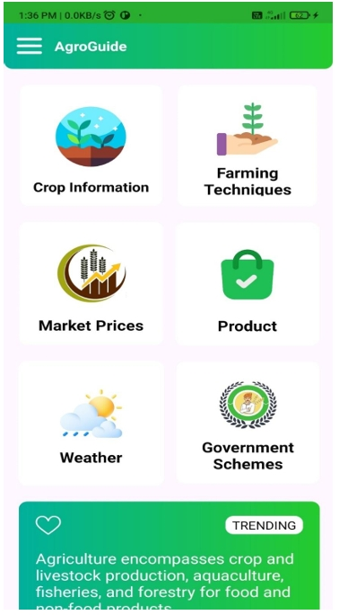

# **🌱AgroGuide**

A Smart Agriculture Assistance Application

AgroGuide is a user-friendly system designed to help farmers and agriculture enthusiasts by providing crop information, weather insights, soil guidance, and productivity recommendations. The goal of this project is to bring smart agriculture solutions to everyone with a simple, intuitive tool.

**📸 Screenshots**

